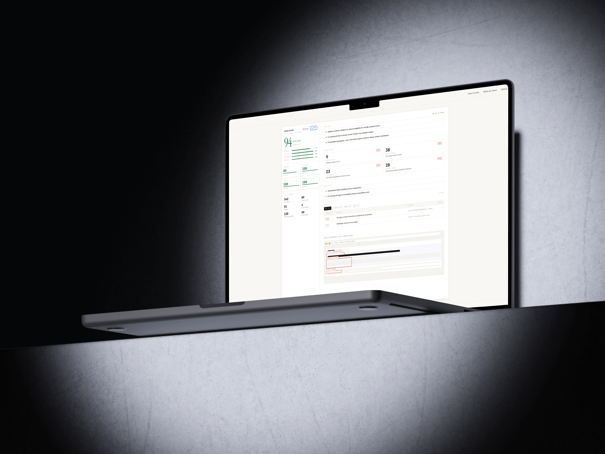

  
  
   
   

  # 🌟 Contrast

  **A free, public web tool that audits any live URL for design quality and accessibility compliance.**  
  *It returns a scored, shareable report covering color contrast, typography consistency, alt text coverage, and spacing. It is NOT just a developer tool. It is NOT another Lighthouse clone.*
  
   

  
  

---

## 📖 About The Project

Contrast was built to bridge the gap between design excellence and accessibility. By simply providing a live URL, Contrast automatically evaluates the page and provides an intuitive, scored report that makes improving your website's UI/UX and accessibility a breeze. 

Whether you are a designer, a founder, or a curious creator, Contrast gives you the insights you need without burying you in technical jargon.

### ✨ Key Features
- **Design Quality Audit:** Checks typography consistency, spacing, and visual hierarchy.
- **Accessibility Compliance:** Verifies color contrast, alt text coverage, and structural semantics.
- **Shareable Reports:** Generate a beautifully designed, scored report that you can easily share with your team.
- **Fast & Reliable:** Powered by cutting-edge web technologies to give you results in seconds.

 

  

 

---

## 🛠️ Built With

This project leverages modern web technologies to ensure a seamless and performant user experience:

- **[Next.js 14](https://nextjs.org/)** - The React Framework for the Web.
- **[Supabase](https://supabase.com/)** - Open source Firebase alternative for backend and database management.
- **[Tailwind CSS](https://tailwindcss.com/)** - A utility-first CSS framework for rapid UI development.
- **[Framer Motion](https://www.framer.com/motion/)** - A production-ready motion library for React.
- **[Axe Core & Playwright](https://playwright.dev/)** - For robust accessibility auditing and headless browser automation.
- **[Vercel](https://vercel.com/)** - Hosting and deployment.

---

## 🚀 Version 2.0 (Coming Soon)

We are constantly pushing to make Contrast better. Here is a sneak peek at what is planned for **V2**:

- **Historical Tracking:** Save past audits to your account and track your design/accessibility scores over time.
- **Deep Dive AI Recommendations:** Get actionable, AI-powered suggestions on exactly how to fix specific contrast or layout issues.
- **Team Workspaces:** Collaborate with designers and developers in shared workspaces.
- **Custom Heuristics:** Configure your own design rules (e.g., custom typography scales or brand color palettes) to audit against.
- **Export Options:** Download detailed reports in PDF and CSV formats.

---

## 👨‍💻 Creator & Brand

**Contrast** is proudly designed and developed by **Anubhav**.

I build products that marry beautiful aesthetics with robust engineering. Check out my other work, read my thoughts on design, and let's connect!

- **Portfolio:** [anubhavportfolio.vercel.app](https://anubhavportfolio.vercel.app/)
- **Live Project:** [getcontrast.vercel.app](https://getcontrast.vercel.app)

---

## 📄 License

This project is open source and available under the [MIT License](LICENSE).

  <i>If you find Contrast helpful, please consider giving it a ⭐ and sharing it with your network!</i>

